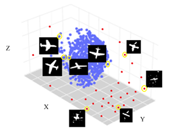
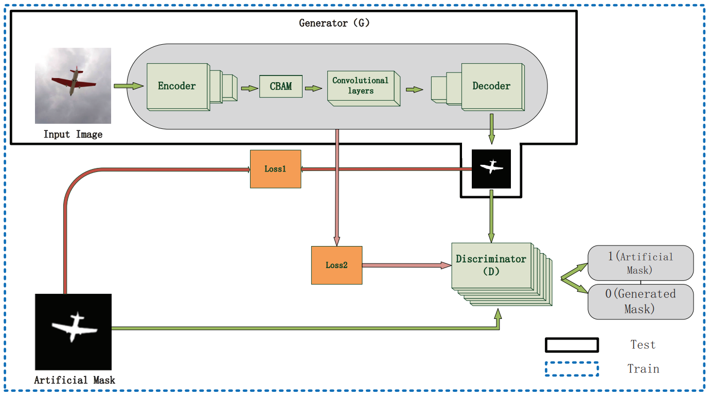
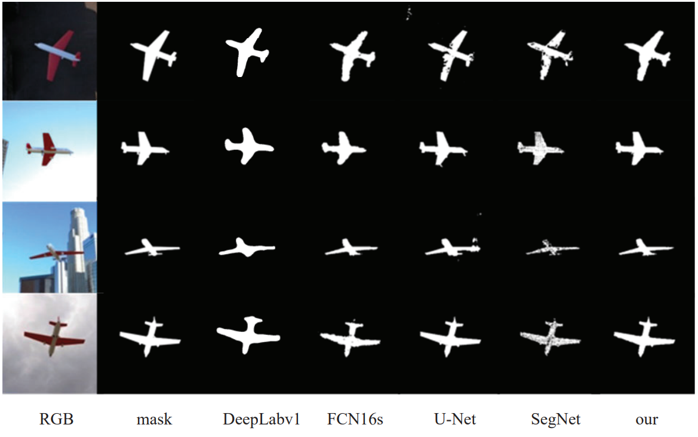
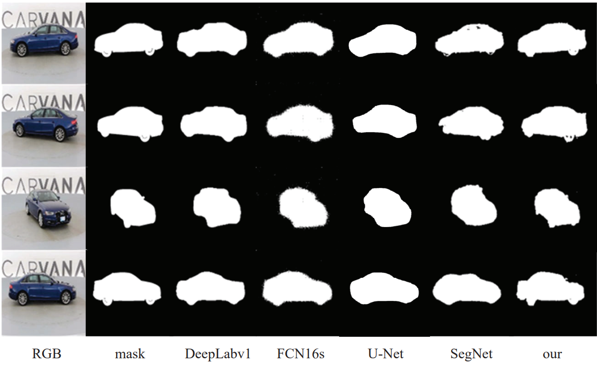

# PyTorch implementation of UAGAN(U-net Attention Generative Adversarial Networks)

This repository contains the source code for the paper "A High-precision Semantic Segmentation
Method Combining Adversarial Learning and Attention Mechanism"  

#### Author email: gaotong_dream@foxmail.com    


  




## Datasets
We use the renderings of [ShapeNet](https://www.shapenet.org/) and [Carvana](https://www.kaggle.com/) in our experiments,which are available below:
- ShapeNet rendering images: http://genre.csail.mit.edu/downloads/shapenet_cars_chairs_planes_20views.tar
- Carvana images and masks: https://www.kaggle.com/ (Please log in to the kaggle website to download)

## Model Structure



## Prerequisites
#### Clone the Code Repository

```
git clone https://github.com/clfs0003/UAGAN
```
#### Install Python Denpendencies

```
cd UAGAN
pip install -r UAGAN_requirements.txt
```
#### Update Settings in `config.py`

You need to update hyperparametersthe of the model and path of the datasets :
```
    parser.add_argument('--image_dir', type=str, default='./dataset/img', help='input RGB image path')
    parser.add_argument('--mask_dir', type=str, default='./dataset/mask', help='input mask path')
    parser.add_argument('--lr', type=float, default='0.0002', help='learning rate')
    parser.add_argument('--batch_size', type=int, default='5', help='batch_size in training')
    parser.add_argument('--b1', type=float, default=0.5, help='adam: decay of first order momentum of gradient')
    parser.add_argument("--b2", type=float, default=0.999, help="adam: decay of first order momentum of gradient")
    parser.add_argument("--epoch", type=int, default=600, help="epoch in training")

```
## Part of the experimental results are as follows
results of ShapeNet:

results of Carvana:



## Get Started
To train UAGAN, you can simply use the following command:

```
python3 main.py
```

Note:
Since our paper has not been published yet, we only show the model structure and training code. When the paper is published, we will publish the full work of the paper.
Welcome scholars to discuss and exchange.

## License

This project is open sourced under MIT license.
